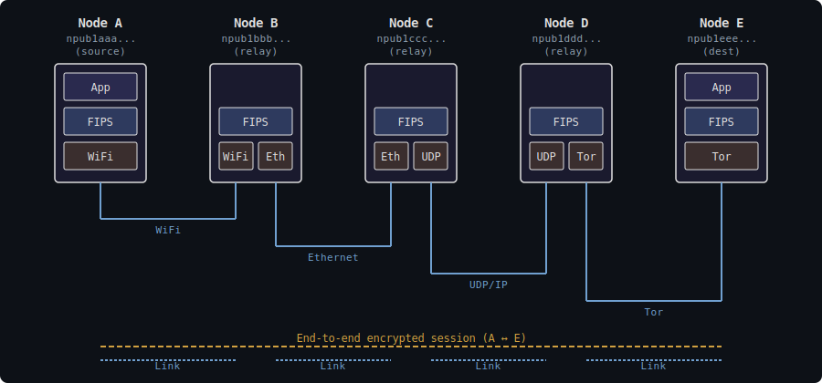
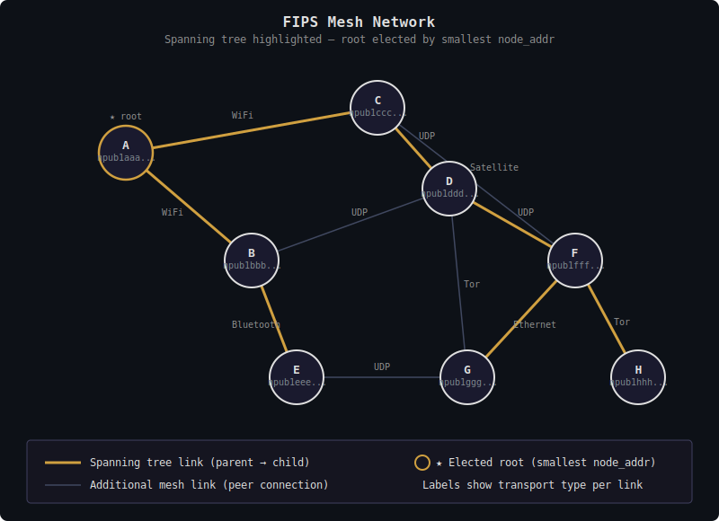

# FIPS: Federated Interoperable Peering System

## What is FIPS?

FIPS is a self-organizing mesh network that can operate over any transport
medium — radio, serial links, Tor, local networks, or the existing internet as
an overlay. The long-term goal is infrastructure that can function alongside or
ultimately replace dependence on the Internet.

Nodes in the mesh route traffic for each other using Nostr identities (npubs)
as network addresses. Applications can access the mesh through a native FIPS
datagram service, or through an IPv6 adaptation layer that presents each node
as an IPv6 endpoint for compatibility with existing IP-based applications.

## Why FIPS?

**Infrastructure independence**: The internet depends on centralized
infrastructure — ISPs, backbone providers, DNS, certificate authorities. FIPS
works over any transport that can carry packets: a LoRa radio link between
mountain towns, a serial cable between air-gapped systems, onion-routed
connections through Tor, or the existing internet as an overlay. When the
internet is unavailable, unreliable, or untrusted, the mesh still works.

**End-to-end security**: FIPS provides secure, authenticated, and encrypted
communication between any two nodes in the mesh, independent of the mix of
transports used along the routed path between them.

**Privacy by design**: Traffic flows through encrypted tunnels at every hop.
Intermediate nodes route packets but cannot read their contents. Metadata
exposure is limited to direct peers only.

**Zero configuration**: Nodes discover each other and build routing
automatically. Connect to one peer and you can reach the entire mesh. The
network self-heals around failures and adapts to changing topology.

**Self-sovereign identity**: FIPS nodes generate their own addresses, node IDs,
and security credentials without coordination with any central authority. The
identity system uses Nostr keypairs (secp256k1), so existing npub/nsec pairs
work directly.

## A Self-Organizing Mesh

Traditional networks are built top-down. A central authority assigns addresses,
configures routing tables, provisions hardware, and manages the topology. If the
authority disappears or the infrastructure fails, the network fails with it.
Nodes cannot reach each other without infrastructure mediating the connection.

FIPS inverts this model. There is no central authority, no address assignment
service, no routing table pushed from above. Each node generates its own
identity from a cryptographic keypair. Each node independently decides which
peers to connect to and which transports to use. From these local decisions
alone, the network self-organizes:

- A **spanning tree** forms through distributed parent selection, giving every
  node a coordinate in the network without any node knowing the full topology
- **Bloom filters** propagate through gossip, so each node learns which peers
  can reach which destinations — again without global knowledge
- **Routing decisions** are made locally at each hop, using only the node's
  immediate peers and cached coordinate information

Each peer link and end-to-end session actively measures RTT, loss, jitter, and
goodput through a lightweight in-band Metrics Measurement Protocol (MMP),
providing operator visibility and a foundation for future quality-aware routing.

The result is a network that builds itself from the bottom up, heals around
failures automatically, and scales without central coordination. Adding a node
is as simple as connecting to one existing peer — the network integrates the
new node through its normal gossip protocols.

## Design Goals

1. **Nostr-native identity** — Use Nostr keypairs as node identities
2. **Transport agnostic** — Support IP, wireless, serial, onion, and other
   link types
3. **Self-organizing** — Automatic topology discovery and route optimization
4. **Privacy preserving** — Minimize metadata leakage across untrusted links
5. **Resilient** — Self-healing with graceful degradation
6. **Reuse Nostr primitives** — Leverage secp256k1, Schnorr signatures, and
   SHA-256

---

## Protocol Architecture

FIPS is organized in three protocol layers, each with distinct responsibilities
and clean service boundaries. Understanding these layers is key to understanding
how FIPS works.

```text
┌─────────────────────────────────────────────────────────────┐
│                     Applications                            │
│            (native FIPS API  /  IPv6 adapter)               │
├─────────────────────────────────────────────────────────────┤
│                                                             │
│   FIPS Session Protocol (FSP)                               │
│   End-to-end authenticated encryption between endpoints     │
│   Session lifecycle, coordinate caching, replay protection  │
│                                                             │
├─────────────────────────────────────────────────────────────┤
│                                                             │
│   FIPS Link Protocol (FLP)                                  │
│   Hop-by-hop link encryption, peer authentication           │
│   Spanning tree, bloom filters, routing, forwarding         │
│                                                             │
├─────────────────────────────────────────────────────────────┤
│                                                             │
│   Transport Layer                                           │
│   Datagram delivery over arbitrary media                    │
│   UDP, Ethernet, LoRa, Tor, serial, ...                    │
│                                                             │
└─────────────────────────────────────────────────────────────┘
```

### Mapping to Traditional Networking

Readers familiar with the OSI model or TCP/IP networking may find it helpful to
see how FIPS concepts relate to traditional layers:

```text
 Traditional          FIPS                    Key Difference
─────────────────────────────────────────────────────────────────────
 Application          Applications            Same role — user-facing
                      (IPv6 adapter)          software
─────────────────────────────────────────────────────────────────────
 Transport (TCP/UDP)  (not present)           FIPS provides datagrams,
                                              not reliable streams
─────────────────────────────────────────────────────────────────────
 Session              FSP                     End-to-end encryption
                                              and session management
─────────────────────────────────────────────────────────────────────
 Network (IP)         FLP                     Routing, forwarding,
                                              address resolution —
                                              but self-organizing
─────────────────────────────────────────────────────────────────────
 Link (Ethernet/WiFi) FLP (link encryption)   Peer authentication
                                              and hop-by-hop crypto
─────────────────────────────────────────────────────────────────────
 Physical (PHY)       Transport layer         Abstracted — FIPS
                      (UDP, radio, serial)    treats all media the
                                              same way
─────────────────────────────────────────────────────────────────────
```

Note that FLP spans what would traditionally be separate link and network
layers. This is intentional — in a self-organizing mesh, the same layer that
authenticates peers also makes routing decisions, because routing depends on
authenticated peer state (spanning tree positions, bloom filters).

### Layer Responsibilities

**Transport layer**: Delivers datagrams between endpoints over a specific
medium. Each transport type (UDP socket, Ethernet interface, radio modem)
implements the same abstract interface: send and receive datagrams, report MTU.
The transport layer knows nothing about FIPS identities, routing, or encryption.
It provides raw datagram delivery to FLP above.

See [fips-transport-layer.md](fips-transport-layer.md) for the transport layer
specification.

**FIPS Link Protocol (FLP)**: Manages peer connections, authenticates peers via
Noise IK handshakes, and encrypts all traffic on each link. FLP is where the
mesh organizes itself — nodes exchange spanning tree announcements and bloom
filters with their direct peers, and FLP makes forwarding decisions for transit
traffic. FLP provides authenticated, encrypted forwarding to FSP above.

See [fips-link-layer.md](fips-link-layer.md) for the FLP specification and
[fips-mesh-operation.md](fips-mesh-operation.md) for how FLP's routing and
self-organization work in practice.

**FIPS Session Protocol (FSP)**: Provides end-to-end authenticated encryption
between any two nodes, regardless of how many intermediate hops separate them.
FSP manages session lifecycle (setup, data transfer, teardown), caches
destination coordinates for efficient routing, and handles the warmup strategy
that keeps transit node caches populated. FSP provides a datagram service to
applications above.

See [fips-session-layer.md](fips-session-layer.md) for the FSP specification.

**IPv6 adaptation layer**: Sits above FSP and adapts the FIPS datagram service
for unmodified IPv6 applications. Provides DNS resolution (npub → fd::/8
address), identity cache management, MTU enforcement, and a TUN interface.
This is the primary way existing applications use the FIPS mesh.

See [fips-ipv6-adapter.md](fips-ipv6-adapter.md) for the IPv6 adapter.

---

## Architecture Overview



Each link uses a different transport, but the end-to-end session encryption is
independent of the transport mix. Intermediate nodes decrypt the link layer to
make routing decisions, then re-encrypt for the next hop. They cannot read the
session-layer payload.

```text
 Application ──────────── End-to-end FSP session ──────────── Application
      │                                                            │
      ▼                                                            ▼
 ┌─────────┐    FLP link    ┌─────────┐    FLP link    ┌─────────┐
 │ Node A  │◄──────────────►│ Node B  │◄──────────────►│ Node C  │
 └────┬────┘  (Noise IK)    └────┬────┘  (Noise IK)    └────┬────┘
      │                          │                          │
   UDP/IP                     Ethernet                    LoRa
  transport                  transport                  transport
```

Each FLP link operates over its own transport type, with independent link-layer
encryption. The FSP session spans the entire path, providing end-to-end
confidentiality that is independent of the transport mix along the route.


Internally, each node is organized in the three protocol layers. At the top,
two application interfaces provide access to the mesh: a native datagram API
addressed by npub, and an IPv6 TUN adapter that maps npubs to `fd::/8`
addresses so unmodified IP applications can use the network transparently. The
FSP and FLP layers in the middle implement session management, routing, and
encryption. At the bottom, transport plugins handle the physical diversity —
each plugin implements the same interface, so the router treats UDP, Ethernet,
LoRa, Tor, and serial links identically. Adding a new transport requires no
changes to the routing or session layers.

---

## Identity System

FIPS uses Nostr keypairs (secp256k1) as node identities. The public key
identifies the node; the private key signs protocol messages and establishes
encrypted sessions.

The FIPS address (synonymous with the pubkey) is the primary means for
application-layer software to identify communication endpoints. The
bech32-encoded npub can be used interchangeably for user interface purposes.
The FIPS datagram service is exposed to the application layer either via a
native API to the FIPS node software, or through an IPv6 adaptation layer that
converts the node identity into an IPv6 address and provides DNS resolution
from npub to this address for traditional software.

### Node Address Derivation


The pubkey is the node's cryptographic identity, used in Noise IK handshakes
for both link and session encryption. It is never exposed beyond the endpoints
of an encrypted channel. The node_addr, a one-way SHA-256 hash truncated to
16 bytes, serves as the routing identifier in packet headers and bloom filters.
Intermediate routers see only node_addrs — they can forward traffic without
learning the Nostr identities of the endpoints. An observer can verify "does
this node_addr belong to pubkey X?" but cannot enumerate which pubkeys are
communicating by inspecting traffic. The IPv6 address prepends `fd` to the
first 15 bytes of the node_addr, providing an overlay address for unmodified
IP applications via the TUN interface.

### Address Format

When using the IPv6 adaptation layer, FIPS addresses use the IPv6 Unique Local
Address (ULA) prefix `fd00::/8`, providing 120 bits from the node_addr hash.
These are overlay identifiers — they appear in the TUN interface for application
compatibility but are not routable on the underlying transport. The fd prefix
ensures no collision with addresses that may be in use on the transport network.

### Identity Verification

The Noise Protocol Framework is used to mutually authenticate both peer-to-peer
link connections (at FLP) and end-to-end session traffic (at FSP), proving each
party controls the private key for their claimed identity.

See [fips-link-layer.md](fips-link-layer.md) for peer authentication and
[fips-session-layer.md](fips-session-layer.md) for end-to-end session
establishment.

### Terminology: Addresses and Identifiers

FIPS uses several related but distinct identifiers at different protocol layers:

| Term | Layer | Visible To | Description |
| ---- | ----- | ---------- | ----------- |
| **FIPS address / pubkey** | Application/FSP | Endpoints only | 32-byte secp256k1 public key — the endpoint identity |
| **npub** | (encoding) | Human readers | Bech32 encoding of pubkey for display/config |
| **node_addr** | FLP (routing) | Routing nodes | SHA-256(pubkey) truncated to 128 bits — cannot be reversed to pubkey |
| **link_addr** | Transport | Direct peers | IP:port, MAC, .onion — transport-specific |
| **IPv6 address** | IPv6 adapter | Applications | fd::/8 derived from node_addr — optional compatibility |

**Privacy property**: The pubkey (FIPS address / Nostr identity) is never
exposed to intermediate routing nodes. They see only the node_addr, a one-way
hash. An observer can verify "does this node_addr belong to pubkey X?" but
cannot derive the pubkey from traffic.

---

## Two-Layer Encryption

FIPS uses independent encryption at two protocol layers:

| Layer | Scope | Pattern | Purpose |
| ----- | ----- | ------- | ------- |
| **FLP (Link)** | Hop-by-hop | Noise IK | Encrypt all traffic on each peer link |
| **FSP (Session)** | End-to-end | Noise IK | Encrypt application payload between endpoints |

### Link Layer (Hop-by-Hop)

When two nodes establish a direct connection, they perform a Noise IK
handshake. This authenticates both parties and establishes symmetric keys for
encrypting all traffic on that link. Every packet between direct peers is
encrypted — gossip messages, routing queries, and forwarded session datagrams
alike.

The IK pattern is used because outbound connections know the peer's npub from
configuration, while inbound connections learn the initiator's identity from
the first handshake message.

### Session Layer (End-to-End)

FIPS establishes end-to-end encrypted sessions between any two communicating
nodes using Noise IK, regardless of whether they are direct peers or separated
by intermediate routers. The initiator knows the destination's npub; the
responder learns the initiator's identity from the handshake — the same
asymmetry as link-layer connections.

Both layers always apply. For adjacent peers, application traffic is encrypted
twice: once by the session layer (end-to-end) and once by the link layer
(hop-by-hop). This uniform model means:

- No special case for "local peer" vs "remote destination"
- Topology changes (a direct peer becomes reachable only through
  intermediaries) don't affect sessions
- The link layer remains purely a transport concern

A packet from A to adjacent peer B:

1. A encrypts payload with A↔B session key (FSP)
2. A wraps in SessionDatagram, encrypts with A↔B link key (FLP), sends to B
3. B decrypts link layer, then decrypts session layer to get payload

A packet from A to D through intermediate node B:

1. A encrypts payload with A↔D session key (FSP)
2. A wraps in SessionDatagram, encrypts with A↔B link key (FLP), sends to B
3. B decrypts link layer, reads destination, re-encrypts with B↔D link key
4. D decrypts link layer, then decrypts session layer to get payload

Intermediate nodes can route based on destination node_addr but cannot read
session-layer payloads.

See [fips-link-layer.md](fips-link-layer.md) for link encryption and
[fips-session-layer.md](fips-session-layer.md) for session encryption.

---

## Routing and Mesh Operation

FIPS routing is entirely distributed — each node makes forwarding decisions
using only local information. There are no routing tables pushed from above, no
link-state floods, and no distance-vector exchanges. Instead, two complementary
mechanisms provide the information each node needs.

### Spanning Tree: The Coordinate System



Nodes self-organize into a spanning tree rooted at a deterministically-elected
node (the one with the smallest node_addr). Each node selects a single parent
from among its direct peers, and the resulting tree gives every node a
**coordinate** — its path from itself to the root.

These coordinates enable distance calculations between any two nodes: the
distance is the number of hops from each node to their lowest common ancestor
in the tree. This provides a metric for routing decisions without any node
needing to know the full network topology.

The tree maintains itself through gossip — nodes exchange TreeAnnounce messages
with their peers, propagating parent selections and ancestry chains. Changes
cascade through the tree proportional to depth, not network size. If the
network partitions, each segment elects its own root and reconverges
automatically when segments rejoin.

See [fips-spanning-tree.md](fips-spanning-tree.md) for the tree algorithms and
[spanning-tree-dynamics.md](spanning-tree-dynamics.md) for detailed convergence
walkthroughs.

### Bloom Filters: Candidate Selection

Each node maintains bloom filters summarizing which destinations are reachable
through each of its peers. Bloom filters propagate via gossip, with each node
computing outbound filters by merging the filters received from its other
peers. At steady state, filters represent the entire reachable network.

Bloom filters answer a single question: "can peer P possibly reach destination
D?" The answer is either "no" (definitive) or "maybe" (probabilistic — false
positives are possible). This is **candidate selection**, not routing — bloom
filters identify which peers are worth considering, but the actual forwarding
decision requires tree coordinates to rank those candidates by distance.

See [fips-bloom-filters.md](fips-bloom-filters.md) for filter parameters and
mathematical properties.

### Routing Decisions

At each hop, FLP makes a local forwarding decision using the following priority
chain:

1. **Local delivery** — the destination is this node
2. **Direct peer** — the destination is an authenticated neighbor
3. **Bloom-guided candidate selection** — bloom filters identify peers that can
   reach the destination; tree coordinates rank them by distance
4. **Greedy tree routing** — fallback when bloom filters haven't converged;
   forward to the peer that minimizes tree distance to the destination
5. **No route** — destination unreachable; send error signal to source

All multi-hop routing depends on knowing the destination's tree coordinates.
These are cached at each node after being learned through discovery
(LookupRequest/LookupResponse) or session establishment (SessionSetup). The
coordinate cache is the critical piece that enables efficient forwarding.

### Coordinate Caching and Discovery

When a node first needs to reach an unknown destination, it sends a
LookupRequest that floods through the network guided by bloom filters. The
destination responds with its coordinates, which the source caches. Subsequent
traffic routes efficiently using the cached coordinates.

Session establishment (SessionSetup) also carries coordinates, warming transit
node caches along the path so that data packets can be forwarded without
individual discovery at each hop.

### Error Recovery

When routing fails — because cached coordinates are stale or a path has
broken — transit nodes signal the source:

- **CoordsRequired**: A transit node lacks the destination's coordinates.
  The source re-initiates discovery and resets its coordinate warmup strategy.
- **PathBroken**: Greedy routing reached a dead end. The source re-discovers
  the destination's current coordinates.

Both signals trigger active recovery, and are rate-limited to prevent storms
during topology changes.

See [fips-mesh-operation.md](fips-mesh-operation.md) for the complete routing
and mesh behavior description.

---

## Transport Abstraction

FIPS is transport-agnostic. The protocol operates identically whether peers
connect over UDP, Ethernet, LoRa radio, serial cables, or Tor hidden services.

A **transport** is a physical or logical interface: a UDP socket, an Ethernet
NIC, a Tor client, a radio modem. A **link** is a peer connection established
over a transport. Transport addresses (IP:port, MAC address, .onion) are opaque
to all layers above FLP — they are used only to deliver datagrams and are
discarded once FLP has authenticated the peer.

A node with multiple transports automatically bridges between networks. Peers
from all transports feed into a single spanning tree; the router selects the
best path regardless of transport type. If one transport fails, traffic
automatically routes through alternatives.

| Category | Examples | Characteristics |
| -------- | -------- | --------------- |
| Overlay | UDP/IP, TCP/TLS, WebSocket | Internet connectivity, NAT traversal |
| Shared medium | Ethernet, WiFi, Bluetooth, LoRa | Local discovery, broadcast |
| Point-to-point | Serial, dialup | Static config, no discovery |
| Anonymity | Tor, I2P | High latency, strong privacy |

> **Implementation status**: UDP/IP is the only implemented transport. All
> others are future directions.

See [fips-transport-layer.md](fips-transport-layer.md) for transport layer
design.

---

## Security

### Threat Model

FIPS assumes adversaries with varying capabilities:

- **Passive adversary**: Can observe traffic on links they control
- **Active adversary**: Can inject, modify, drop, or replay packets
- **Sybil adversary**: Can create many node identities

### Cryptographic Protections

**Link encryption**: Every peer connection uses Noise IK, providing mutual
authentication and forward secrecy. An observer on the underlying transport
sees only encrypted packets.

**End-to-end encryption**: Session-layer Noise IK encrypts payloads between
endpoints. Intermediate routers cannot read application data.

**Signature verification**: TreeAnnounce messages carry signed parent
declarations. Direct peers verify signatures using keys established during
the Noise IK handshake; ancestry beyond direct peers uses transitive trust
in the v1 protocol.

**Replay protection**: Counter-based nonces with sliding window for encrypted
packets at both the link and session layers. Sequence numbers on protocol
announcements prevent replay of stale state.

### Sybil Resistance

Creating many identities is cheap, but exploiting them is constrained:

- **Discretionary peering**: Node operators choose who to peer with. An
  attacker with many identities still needs real nodes to accept their
  connections.
- **Tree coordinate verification**: Nodes cannot claim arbitrary tree positions
  without valid signed ancestry chains from real nodes.
- **Rate limiting**: Handshake rate limiting constrains how fast attackers can
  establish connections.

### Metadata Exposure

Each entity in the network sees different information:

| Entity | Can See |
| ------ | ------- |
| Transport observer | Encrypted packets, timing, packet sizes |
| Direct peer | Your npub (identity), traffic volume, timing |
| Intermediate router | Source and destination node_addrs, packet size |
| Destination | Your npub (identity), payload content |

Intermediate routers see node_addrs, not npubs. Since node_addrs are derived
from pubkeys via one-way SHA-256 hash, routers cannot determine the actual
identities of the endpoints they route for.

The session layer hides payload content from intermediate routers. The link
layer hides everything from passive observers on the underlying transport.

---

## Prior Work

FIPS builds on proven designs rather than inventing new cryptography or routing
algorithms.

**Routing**: The spanning tree coordinates, bloom filter candidate selection,
and greedy routing algorithms are adapted from
[Yggdrasil v0.5](https://yggdrasil-network.github.io/2023/10/22/upcoming-v05-release.html)
and its [Ironwood](https://github.com/Arceliar/ironwood) routing library. FIPS
adapts these for multi-transport operation and Nostr identity integration.

**Encryption**: Link and session encryption use the
[Noise Protocol Framework](https://noiseprotocol.org/), the same foundation
used by WireGuard, Lightning Network, and other production systems. FIPS uses
the IK pattern for both link authentication and end-to-end sessions.

**Cryptographic primitives**: FIPS reuses Nostr's cryptographic stack —
secp256k1 for keys, Schnorr signatures, SHA-256 for hashing, and
ChaCha20-Poly1305 for authenticated encryption. No novel cryptography.

**Session management**: The index-based session dispatch follows WireGuard's
approach, enabling O(1) packet routing without relying on source addresses.

---

## Further Reading

### Protocol Layers

| Document | Description |
| -------- | ----------- |
| [fips-transport-layer.md](fips-transport-layer.md) | Transport layer: abstraction, types, services provided to FLP |
| [fips-link-layer.md](fips-link-layer.md) | FLP: peer authentication, link encryption, forwarding |
| [fips-session-layer.md](fips-session-layer.md) | FSP: end-to-end encryption, session lifecycle |
| [fips-ipv6-adapter.md](fips-ipv6-adapter.md) | IPv6 adaptation: DNS, TUN interface, MTU enforcement |

### Mesh Behavior and Wire Formats

| Document | Description |
| -------- | ----------- |
| [fips-mesh-operation.md](fips-mesh-operation.md) | How the mesh operates: routing, discovery, error recovery |
| [fips-wire-formats.md](fips-wire-formats.md) | Complete wire format reference for all protocol layers |

### Supporting References

| Document | Description |
| -------- | ----------- |
| [fips-spanning-tree.md](fips-spanning-tree.md) | Spanning tree algorithms and data structures |
| [fips-bloom-filters.md](fips-bloom-filters.md) | Bloom filter parameters, math, and computation |
| [spanning-tree-dynamics.md](spanning-tree-dynamics.md) | Scenario walkthroughs: convergence, partitions, recovery |

### Implementation

| Document | Description |
| -------- | ----------- |
| [fips-software-architecture.md](fips-software-architecture.md) | Stable architectural decisions guiding the codebase |
| [fips-state-machines.md](fips-state-machines.md) | Phase-based state machine pattern (Rust) |
| [fips-configuration.md](fips-configuration.md) | YAML configuration reference |

### External References

- [Yggdrasil Network](https://yggdrasil-network.github.io/)
- [Yggdrasil v0.5 Release Notes](https://yggdrasil-network.github.io/2023/10/22/upcoming-v05-release.html)
- [Ironwood Routing Library](https://github.com/Arceliar/ironwood)
- [Nostr Protocol](https://github.com/nostr-protocol/nips)
- [Noise Protocol Framework](https://noiseprotocol.org/)
