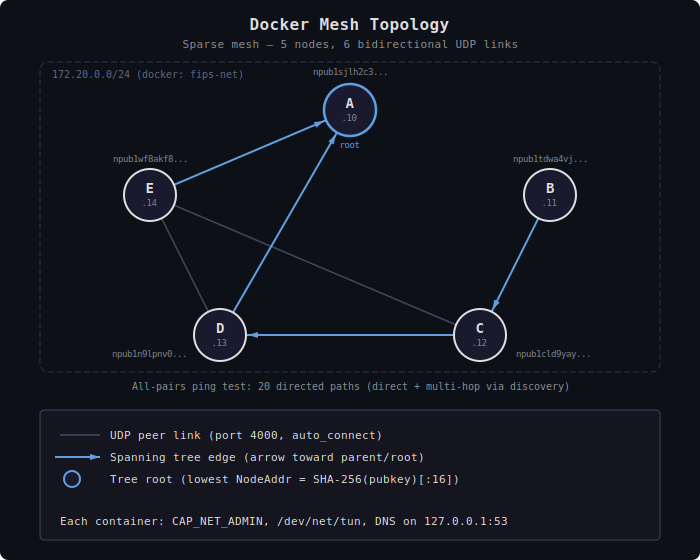
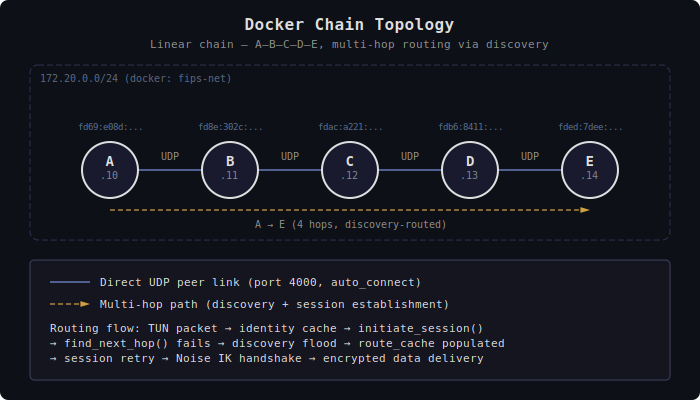

# Static Docker Network Test Harness

Multi-node integration test for FIPS using Docker containers with fixed
topologies. Multiple topologies are provided: a sparse mesh (5 nodes, 6
links), a linear chain (5 nodes, 4 links), and a mesh with a public external
node. All exercise the full FIPS stack including TUN devices, DNS resolution,
peer link encryption, spanning tree construction, and discovery-driven
multi-hop routing.

## Prerequisites

- Docker with the compose plugin
- Rust toolchain (for building the FIPS binary)
- Python 3 (for identity derivation; stdlib only, no packages required)

## Quick Start

Build the binary and generate configs:

```bash
./testing/static/scripts/build.sh
```

Start the mesh (default topology):

```bash
docker compose -f testing/static/docker-compose.yml up -d
./testing/static/scripts/ping-test.sh mesh      # 20/20 expected
./testing/static/scripts/iperf-test.sh mesh     # bandwidth test
docker compose -f testing/static/docker-compose.yml down
```

The mesh profile is activated by default via `.env`. To use a different
topology, specify the profile explicitly:

```bash
docker compose -f testing/static/docker-compose.yml --profile chain up -d
./testing/static/scripts/ping-test.sh chain
docker compose -f testing/static/docker-compose.yml --profile chain down
```

## Topologies

### Mesh



Five nodes with 6 bidirectional UDP links forming a sparse, fully connected
graph. Not all nodes are direct peers -- non-adjacent pairs require
discovery-driven multi-hop routing to establish end-to-end sessions.

The spanning tree is rooted at node A, which has the lexicographically
smallest `NodeAddr` (the first 16 bytes of `SHA-256(pubkey)`). Tree edges
are highlighted in blue in the diagram above.

The ping test exercises all 20 directed pairs (5 nodes x 4 targets each),
covering both direct-peer and multi-hop paths.

| Link | Type |
|------|------|
| A -- D | tree edge (D's parent is A) |
| A -- E | tree edge (E's parent is A) |
| C -- D | tree edge (C's parent is D) |
| B -- C | tree edge (B's parent is C) |
| D -- E | non-tree link |
| C -- E | non-tree link |

### Chain



Five nodes in a linear chain: A -- B -- C -- D -- E. Each node peers only with
its immediate neighbors. Multi-hop communication (e.g., A to E) requires the
discovery protocol to find routes through intermediate nodes.

The ping test covers:

- Adjacent hops: A->B, B->C (1 hop each)
- Multi-hop: A->C (2 hops), A->D (3 hops), A->E (4 hops)
- Reverse: E->A (4 hops)

### Mesh-Public

Same five Docker nodes as the mesh topology, plus an external public node
(`pub`) at a remote IP. Nodes A, B, and C peer with the public node. This
topology is for testing mixed local/remote mesh operation.

External nodes are not managed by Docker -- only their identity and address
appear in the topology file so that Docker nodes can peer with them.

## Configuration Management

### File Structure

```text
testing/static/
├── Dockerfile                          # Container image definition
├── docker-compose.yml                  # Service definitions for all topologies
├── resolv.conf                         # DNS config pointing to FIPS resolver
├── .env                                # Default compose profile
├── configs/
│   ├── node.template.yaml              # Template for all node configs
│   └── topologies/
│       ├── mesh.yaml                   # Mesh topology definition
│       ├── chain.yaml                  # Chain topology definition
│       └── mesh-public.yaml            # Mesh + external public node
├── generated-configs/                  # Auto-generated (gitignored)
│   ├── npubs.env                       # NPUB_A=..., NPUB_B=..., etc.
│   ├── mesh/
│   │   ├── node-a.yaml ... node-e.yaml
│   ├── mesh-public/
│   │   ├── node-a.yaml ... node-e.yaml
│   └── chain/
│       ├── node-a.yaml ... node-e.yaml
├── scripts/
│   ├── build.sh                        # Build binary + generate configs
│   ├── generate-configs.sh             # Generate node configs from topology
│   ├── derive-keys.py                  # Deterministic nsec/npub derivation
│   ├── ping-test.sh                    # Connectivity test
│   ├── iperf-test.sh                   # Bandwidth test
│   └── netem.sh                        # Network impairment
├── docker-mesh-topology.svg            # Mesh topology diagram
└── docker-chain-topology.svg           # Chain topology diagram
```

### Topology Files

Each topology file in `configs/topologies/` defines:

- **Node identities**: nsec (hex) and npub (bech32) for each node
- **Addresses**: `docker_ip` for Docker-managed nodes, `external_ip` for
  remote nodes not managed by Docker
- **Peer connections**: which nodes peer with each other

Example entry:

```yaml
nodes:
  a:
    nsec: "0102030405060708..."
    npub: "npub1sjlh2c3..."
    docker_ip: "172.20.0.10"
    peers: [d, e]
```

External nodes use `external_ip` instead of `docker_ip`. Config generation
skips external nodes (they run outside Docker) but includes their identity
in peer blocks and the npubs environment file.

### Generating Configs

```bash
./testing/static/scripts/generate-configs.sh <topology> [mesh-name]
```

This reads the topology definition and generates:

1. Per-node YAML config files in `generated-configs/<topology>/`
2. `generated-configs/npubs.env` with all node npubs as environment variables

The `npubs.env` file is sourced by the test scripts and injected into
Docker containers via `env_file` in `docker-compose.yml`.

The build script (`scripts/build.sh`) calls `generate-configs.sh`
automatically after compiling.

### Adding a New Topology

1. Create `configs/topologies/<name>.yaml` following the format of
   `mesh.yaml`
2. Add corresponding service definitions to `docker-compose.yml` with
   `profiles: ["<name>"]`
3. Run `./testing/static/scripts/generate-configs.sh <name>` to generate configs

## Deterministic Mesh Identity Derivation

When running multiple test meshes that may peer with the same external node,
each mesh needs unique node identities to avoid key conflicts. The optional
`mesh-name` parameter generates deterministic per-mesh identities:

```bash
# Build with derived identities
./testing/static/scripts/build.sh mesh my-mesh-1

# Or generate configs directly
./testing/static/scripts/generate-configs.sh mesh my-mesh-1
./testing/static/scripts/generate-configs.sh mesh-public my-mesh-1
```

### How It Works

For each Docker node (those with `docker_ip`), the identity is derived as:

```text
nsec = sha256(mesh_name + "|" + node_id)    # e.g., sha256("my-mesh-1|a")
npub = bech32("npub", secp256k1_pubkey(nsec))
```

External nodes (those with `external_ip`) always keep their hardcoded
identity from the topology YAML, since they represent real nodes outside
the test environment.

Without a mesh name, the identities from the topology YAML are used as-is
(the original behavior).

### The derive-keys.py Script

The derivation is performed by `scripts/derive-keys.py`, a standalone tool
with no external dependencies (pure Python stdlib: hashlib for SHA-256,
manual secp256k1 scalar multiplication, and BIP-173 bech32 encoding):

```bash
$ ./testing/static/scripts/derive-keys.py my-mesh-1 a
nsec=<64-char-hex>
npub=npub1...
```

### The npubs.env File

Every run of `generate-configs.sh` writes `generated-configs/npubs.env`
containing all node npubs, whether derived or from the topology YAML:

```text
NPUB_A=npub1...
NPUB_B=npub1...
NPUB_C=npub1...
NPUB_D=npub1...
NPUB_E=npub1...
NPUB_PUB=npub1...    # only present for topologies with a pub node
```

This file is:

- **Sourced by test scripts** (`ping-test.sh`, `iperf-test.sh`) to resolve
  node identities for DNS lookups
- **Injected into containers** via the `env_file` directive in
  `docker-compose.yml`, making `$NPUB_A` etc. available as environment
  variables inside each container

## Performance Testing

```bash
./testing/static/scripts/iperf-test.sh [mesh|chain]
./testing/static/scripts/iperf-test.sh mesh --live   # show live iperf3 output
```

Runs iperf3 with:

- Duration: 10 seconds (`-t 10`)
- Parallel streams: 8 (`-P 8`)
- Protocol: TCP over IPv6

## Network Impairment

The `netem.sh` script simulates adverse network conditions using `tc`/`netem`
on all running containers:

```bash
./testing/static/scripts/netem.sh [mesh|chain] <apply|remove|status> [options]
```

### Options

| Option | Description |
| ------ | ----------- |
| `--delay <ms>` | Fixed delay in milliseconds |
| `--jitter <ms>` | Delay variation (requires `--delay`) |
| `--loss <percent>` | Packet loss percentage |
| `--loss-corr <percent>` | Loss correlation for bursty loss |
| `--duplicate <percent>` | Packet duplication percentage |
| `--reorder <percent>` | Packet reordering probability (requires `--delay`) |
| `--corrupt <percent>` | Bit-level corruption percentage |

### Presets

| Preset | Parameters |
| ------ | ---------- |
| `lossy` | 5% loss, 25% correlation |
| `congested` | 50ms delay, 20ms jitter, 2% loss |
| `terrible` | 100ms delay, 40ms jitter, 10% loss, 1% dup, 5% reorder |

### Examples

```bash
# Apply 50ms delay with 5% packet loss
./testing/static/scripts/netem.sh mesh apply --delay 50 --loss 5

# Use a preset
./testing/static/scripts/netem.sh chain apply --preset congested

# Check current rules
./testing/static/scripts/netem.sh mesh status

# Remove all impairment
./testing/static/scripts/netem.sh mesh remove
```

Rules are applied to egress on each container's `eth0` interface. With all
containers impaired equally, both directions of every link see the effect.
The script uses `tc qdisc replace` so it can be re-run safely without
removing rules first.

## Container Configuration

- **Base image**: debian:bookworm-slim
- **Capabilities**: `CAP_NET_ADMIN` (for TUN device creation)
- **Devices**: `/dev/net/tun` mapped into each container
- **DNS**: FIPS built-in resolver on `127.0.0.1:53`
- **Transport**: UDP on port 4000, MTU 1472
- **TUN**: `fips0` interface, MTU 1280

Each node resolves `<npub>.fips` DNS names to FIPS IPv6 addresses via its
local DNS responder, which primes the identity cache for session establishment.

### Background Services

Each container runs the following services alongside FIPS:

| Service | Port | Description                                   |
| ------- | ---- | --------------------------------------------- |
| SSH     | 22   | Root login with no password (test only)       |
| iperf3  | 5201 | Bandwidth testing server (`-s -D`)            |
| HTTP    | 8000 | Python HTTP server serving `/root/index.html` |

All services bind to IPv6 (`::`) and are accessible over the FIPS overlay
using `<npub>.fips` hostnames:

```bash
# HTTP over FIPS
docker exec fips-node-b curl http://$NPUB_A.fips:8000/

# SSH over FIPS
docker exec fips-node-b ssh $NPUB_A.fips

# iperf3 over FIPS
docker exec fips-node-b iperf3 -c $NPUB_A.fips
```

## Troubleshooting

**Stale images after code changes**: Docker compose may cache old layers.
Force a clean rebuild:

```bash
docker compose -f testing/static/docker-compose.yml build --no-cache
```

**Check node logs**:

```bash
docker logs fips-node-a
docker logs -f fips-node-c    # follow
```

**Verify DNS resolution inside a container**:

```bash
docker exec fips-node-a dig AAAA <npub>.fips @127.0.0.1
```

**Verify binary is up to date**: Compare hashes between the local build and
the binary inside the container:

```bash
md5sum testing/static/fips
docker exec fips-node-a md5sum /usr/local/bin/fips
```

**Increase convergence time**: If tests fail intermittently, the 5-second
convergence wait in `ping-test.sh` may be insufficient. Edit the `sleep`
value at the top of the script.

**Missing npubs.env**: If test scripts fail with "npubs.env not found", run
`./testing/static/scripts/generate-configs.sh mesh` (or your topology) first,
or use `./testing/static/scripts/build.sh` which generates configs automatically.
